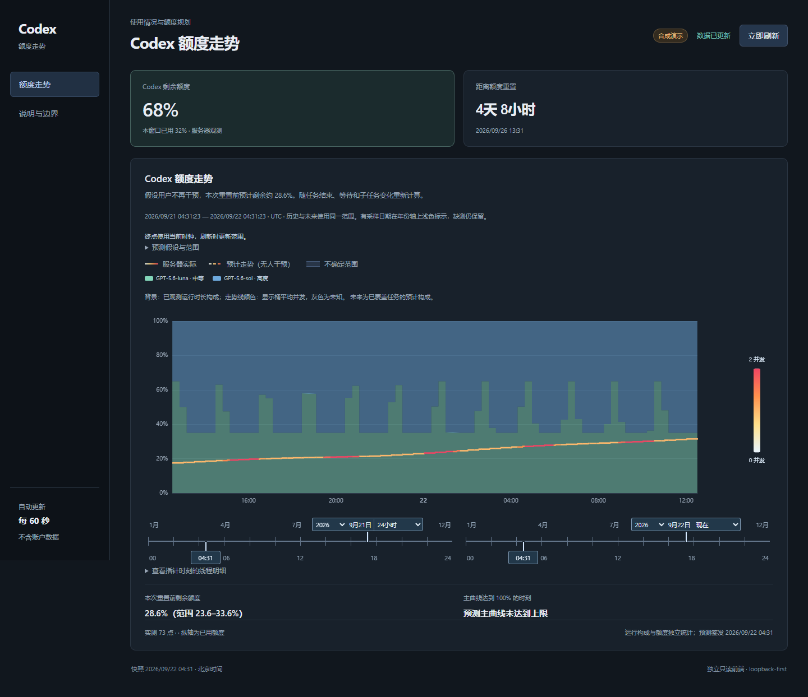
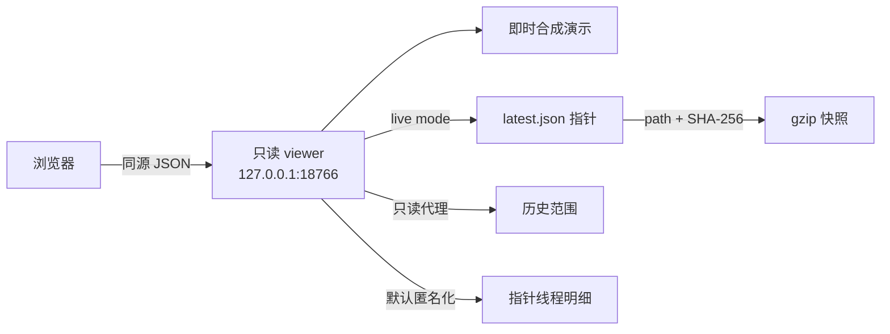

# Codex Quota Dashboard

[](https://github.com/zaidezhang728-arch/codex-quota-dashboard/actions/workflows/ci.yml)
[](LICENSE)
[](pyproject.toml)

把现有监控台的“Codex 额度走势”完整拆成一个可独立运行、可公开审阅的本机前端。主页保留原模块的 DOM、视觉语言和交互；后台只读连接兼容数据源，并在浏览器收到数据前完成完整性校验与隐私投影。

> Community project. Not affiliated with or endorsed by OpenAI.

> [!IMPORTANT]
> 本仓库是额度走势的独立 viewer，不包含原监控系统的采集、历史拟合或 `forecast_v2` 预测引擎。默认模式即时生成明确标记的合成演示数据；实时模式只读显示兼容上游已经计算出的预测。全新电脑可以独立运行演示，但仅安装本仓库不能生成真实账户预测。



## 主页包含什么

- 服务器实际额度、无人追加任务条件下的预测主曲线与不确定范围；
- 已观测与预计运行构成、并发着色和缺测提示；
- “24 小时 / 重置前七天 / 自定义”范围、双端时间标尺和图内缩放；
- 重置与窗口变化边界、指针时刻线程明细；
- 键盘左右键移动时间指针，`Shift + 方向键` 按小时移动；
- 预测终点剩余与达到额度上限的条件结果。

独立版来源基线为原仓库提交 `0d71457`。主页模块的规范化 DOM 与该提交中的原模块相同；独立版只替换了页面外壳、数据装载层和隐私处理。说明页用于公开数据口径，不影响主页。

## 30 秒启动

需要 Python 3.11+。默认模式只使用每次启动即时生成的合成数据，不需要 OpenAI 登录或 API key。建议使用独立虚拟环境：

```powershell
git clone https://github.com/zaidezhang728-arch/codex-quota-dashboard.git
Set-Location .\codex-quota-dashboard
python -m venv .venv
.\.venv\Scripts\python.exe -m pip install .
.\.venv\Scripts\codex-quota-dashboard.exe
```

打开 <http://127.0.0.1:18766/#overview>。

### 连接本机实时监控台

如果兼容服务运行在 `127.0.0.1:18765`：

```powershell
codex-quota-dashboard --mode live --upstream http://127.0.0.1:18765
```

实时模式会：

1. 读取 `/control/latest.json`；
2. 拒绝绝对路径、`..` 和跨来源快照指针；
3. 限制压缩与解压体积；
4. 校验 gzip 快照的 SHA-256；
5. 代理只读历史范围与指针线程接口；
6. 默认把任务标题、线程标识和主机名替换为匿名值。

上游不可用或校验失败时，实时模式明确报错，不会静默混入演示数据。仅在可信的单人本机环境中确有需要时，才使用 `--show-local-titles`。

## 数据边界

| 层级 | 界面含义 | 不代表 |
| --- | --- | --- |
| 服务器观测 | 当前账户窗口的已用/剩余百分比与重置时间 | 单个任务账单、模型归因 |
| 运行构成 | 本机可恢复记录中的线程时长与并发 | 全机完整活动、额度份额 |
| 条件预测 | 在页面所列工作假设下延伸的曲线 | 保证、概率覆盖、官方配额承诺 |
| 条件换算接口 | 当前本机校准范围内的窗口百分点估计 | 美元、通用 credits、API 价格 |

[OpenAI 的官方使用限制文档](https://learn.chatgpt.com/docs/enterprise/usage-limits)区分工作区用量控制与 API 计费。本项目不会把本机条件模型描述成 OpenAI 的通用官方口径。

## 架构



后端只使用 Python 标准库。Apache ECharts 随仓库本地打包，不从 CDN 加载脚本，也不发送遥测。

## 本地接口

| 方法 | 路径 | 说明 |
| --- | --- | --- |
| `GET` | `/healthz` | 只证明 viewer 正在响应 |
| `GET` | `/api/dashboard` | 已投影、默认匿名化的前端快照 |
| `GET` | `/api/quota/history` | 历史范围只读代理或合成结果 |
| `GET` | `/api/quota/runtime` | 指针时刻线程明细，默认匿名化 |
| `POST` | `/api/calibration/quote` | 可选的条件预算估计与上下界 |

`/healthz` 不证明上游新鲜、预测有效或业务成功。

## 隐私与安全默认值

- 默认只监听 `127.0.0.1`；实时上游默认只接受 loopback。
- 不启用 CORS，不提供目录列表，不持久化快照，不含遥测。
- API 使用 `no-store`；页面启用 CSP、`nosniff`、同源资源策略和禁止嵌入。
- 非 loopback 上游与网络监听分别需要显式危险开关。
- 仓库截图、测试和 CI 只使用合成数据；真实快照、SQLite、凭据和本机验收截图不入库。

详见 [SECURITY.md](SECURITY.md)。

## 开发与验证

```powershell
$env:PYTHONPATH = (Resolve-Path .\src).Path
python -m unittest discover -s tests -p test_*.py
npm install
npm test

$env:PLAYWRIGHT_CHANNEL = 'chrome'
npm run test:e2e
```

端到端检查覆盖合成数据标识、图表渲染、范围切换、指针线程明细、说明页、320 px 无横向溢出和键盘可见焦点。

最新的全新目录/虚拟环境验证记录见 [Fresh-machine validation](docs/FRESH_MACHINE_VALIDATION.md)。该记录分别判断安装、合成演示和真实拟合；演示曲线通过不等于真实预测算法通过。

## 项目状态

当前版本是 `0.1.0`。页面、合成演示和只读适配器可运行。真实拟合引擎未包含在本仓库中，因此本仓库没有“新电脑独立完成真实预测”或“真实拟合耗时达标”的验收结论；任何上游预测候选是否采用、是否准确，仍需在其来源系统独立验证。

## 许可与商用

本项目自有代码采用 [MIT License](LICENSE)，允许个人、研究、内部和商业用途，也允许修改、分发、再许可和销售副本。分发本软件或其实质性部分时，需要保留原版权声明和 MIT 许可声明；软件按“原样”提供，不附带担保。

Apache ECharts 继续适用其 Apache License 2.0，详见 [THIRD_PARTY_NOTICES.md](THIRD_PARTY_NOTICES.md)。`Codex`、`OpenAI` 及相关名称和标识的权利属于各自权利人；MIT 许可不授予商标使用权。本项目是社区项目，不代表 OpenAI 官方产品、承诺或背书。简明商用说明见 [LICENSING.md](LICENSING.md)，其中的摘要不替代许可证正文或专业法律意见。

---

## English summary

Codex Quota Dashboard is a privacy-first, loopback-first extraction of the full “Codex quota trend” module. Demo mode is synthetic. Live mode hash-verifies a compatible upstream gzip snapshot, proxies history and runtime details read-only, redacts local identities by default, and fails closed instead of falling back to demo data. This repository does not include the original data-ingestion, fitting, or `forecast_v2` engine. Project-owned code is MIT-licensed and may be used commercially subject to the license terms.
