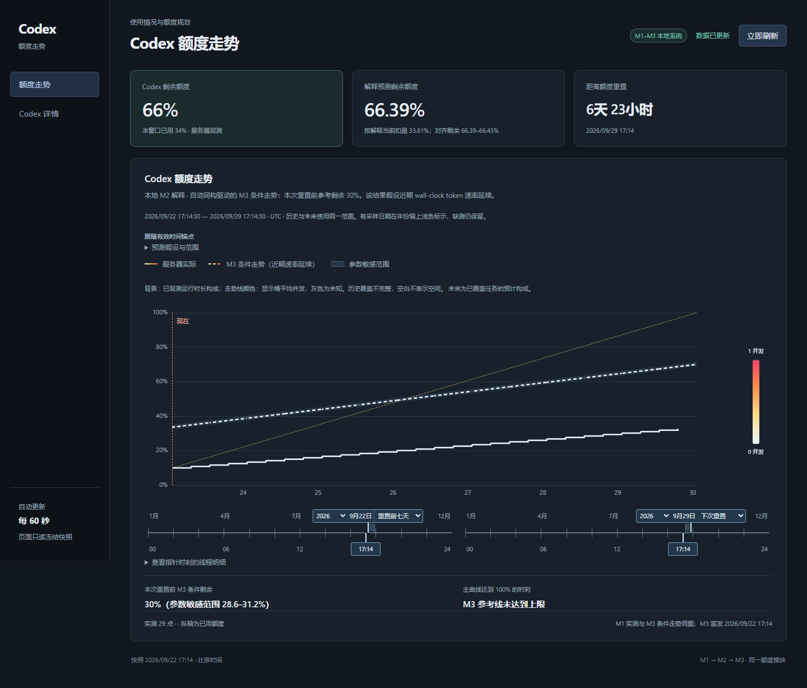

# Codex Quota System

Codex Quota System 是本地优先的额度证据、解释拟合与条件走势系统。它把
服务器额度观测和显式选择的本地 token 记录组织为一条 M1 → M2 → M3
能力链，并通过只读 Web 页面展示实际余额、按解释得到的当前余额和未来条件走势。

> Community project. Not affiliated with or endorsed by OpenAI.

## 核心能力

| 层 | 职责 | 主要输出 |
| --- | --- | --- |
| M1 · 证据 | 读取操作者显式选择的 JSONL 数据源和权威额度观测，去重、冻结并保留截止时间 | 证据快照、实际额度曲线、冻结身份 |
| M2 · 解释 | 在额度显示取整和固定时间对齐候选下求非负 token 通道参数 | 最佳解释参数、严格诊断、残差、对齐敏感范围 |
| M3 · 走势 | 将冻结参数与近期工作负载映射到重置前的额度路径 | 参考线、参数敏感范围、条件用尽状态 |

页面中的三个概念互不替代：

- **Codex 剩余额度**来自服务器观测；
- **解释预测剩余额度**等于 100% 减去 M2 对当前周期的解释扣量；
- **未来走势**由 M3 在页面列明的工作负载假设下计算。

这些输出不是官方费率、账单明细、概率保证或额度承诺。

## 架构

~~~mermaid
flowchart LR
  S[显式选择的数据源] --> C[M1 采集与本地证据库]
  Q[权威额度观测] --> C
  C --> F[冻结任务]
  F --> M1[M1 观测视图]
  F --> M2[M2 解释拟合]
  B[显式启动参考\nreference_only] --> M3
  M2 -->|有限解释优先| M3[M3 条件走势]
  M1 --> P[原子快照]
  M2 --> P
  M3 --> P
  P --> W[loopback Web 页面]
  P --> A[宿主薄适配层]
  A --> W
~~~

拟合不在 HTTP 请求中同步执行。Web 服务只读取最近一次成功冻结的快照；
采集或求解失败时，旧快照仍可读，失败不会被静默包装为新结果。

仓库同时发布可安装的 `codex_quota_dashboard` Python 包。算法入口、启动参考和
Web 静态资源都由该包导出；需要把额度能力组合进现有监控台时，宿主只负责提供
本地证据库、配置和静态输出目录，不复制算法或页面源码。开发环境可使用 editable
安装，稳定环境应固定精确版本或提交，并通过包版本与静态资源身份哈希核对实际
加载结果。

## 算法口径

### M1：证据与时间边界

采集器只扫描配置中列出的文件或目录。它在字节层先筛选会话元数据、
turn context 和 token usage 记录，再解析相关 JSON；提示词、响应正文和工具
payload 不进入本地证据库。额度观测通过本机 Codex App Server 读取，并保留
server_authoritative 来源标记。

### M2：最佳近似解释

M2 为每个模型拟合三个非负通道：

- 未缓存输入 token；
- 缓存输入 token；
- 输出 token。

参数单位是“每百万 token 对应的额度百分点”。系统将服务器显示精度转换为
累计约束，并固定评估 -120、0、+120 秒三个对齐候选。求解首先检查所有约束
能否严格同时满足；严格集合不可行时，使用最小 L1 约束残差形成最佳近似解释，
同时保留 strict_status、总残差、最大残差和受影响约束数。

不同固定对齐候选的参数最小值与最大值构成“对齐敏感范围”。它描述时间对齐
选择带来的变化，不是置信区间或概率区间。参数为零只表示当前证据没有分离出
该通道的有限正贡献，不表示该类 token 免费。

本地 M2 至少需要同一额度周期内两个压缩观测，并出现可见额度变化。单个观测
或未变化的平台只能形成 `insufficient_evidence`，不会把退化的全零参数晋升为
本地解释；若操作者已显式启用启动参考，M3 在此阶段使用该只读参考。

若监控在额度周期中途开始，首个服务器观测作为周期已用量锚点，M2 参数解释
锚点之后的增量。当前解释扣量由“锚点已用量 + 解释增量”得到；增量残差仍
单独保留，锚点不会被包装成模型预测。

### M3：条件额度走势

M3 从近期 wall-clock token 速率生成工作负载计划，使用同一组模型与通道参数
向重置时刻推进。存在有限本地 M2 解释时，M3 优先使用该冻结结果；否则仅在
操作者显式启用时读取只读启动参考。每个快照记录 reference_source、
reference_id、证据截止和算法版本。

## 环境适配式部署

本项目不承诺通用一键安装。操作者需要根据目标运行环境配置数据源、权限、
状态目录、保留期和调度。要求 Python 3.11+；前端测试还需要 Node.js 22+。

~~~powershell
git clone https://github.com/zaidezhang728-arch/codex-quota-dashboard.git
Set-Location .\codex-quota-dashboard
python -m venv .venv
.\.venv\Scripts\python.exe -m pip install ".[test]"
Copy-Item .\config.example.toml .\config.toml
~~~

编辑 config.toml 后先验证：

~~~powershell
.\.venv\Scripts\codex-quota-system.exe --config .\config.toml validate-config
~~~

三个能力开关彼此独立且默认关闭：

~~~toml
[bootstrap_reference]
mode = "off"       # 改为 bundled 或 path 才会启用

[monitoring]
enabled = false     # 改为 true 后才读取 sources / App Server
sources = []
collect_rate_limits = false

[local_fitting]
enabled = false     # 需要 monitoring.enabled=true
~~~

启用所需能力后，可以分步运行：

~~~powershell
# 一次显式采集
codex-quota-system --config .\config.toml collect

# 从当前本地状态原子冻结 M1-M2-M3 快照
codex-quota-system --config .\config.toml refresh

# 仅展示已有快照
codex-quota-system --config .\config.toml serve

# 按配置持续采集、拟合并提供页面
codex-quota-system --config .\config.toml run
~~~

默认页面地址为 http://127.0.0.1:18766/#overview 。非 loopback 监听需要额外
传入 --allow-network-bind，并由部署者自行提供访问控制和传输保护。

## 启动参考与本地适应

随版本发布的启动参考处于 reference_only 状态，默认关闭。它提供粗化参数和
保守边界，使无本地观测历史的冷启动环境在获得当前额度观测与近期工作负载后
可以先形成条件走势。它不替代本地 M2 解释和时间外验证。

启动参考自身定义一个归一化容量单位 `1×`。操作者通过有限正数
`capacity_multiplier` 声明目标容量，参考系数及边界按“参考容量 / 目标容量”
缩放；`1`、`10`、`20` 和其他自定义数值使用同一算法。系统不根据套餐名称
静默猜测容量倍数。本地 M2 一旦形成有限解释，就直接反映目标账户的实际额度
百分点并自动接管 M3，不再应用启动倍数。

~~~toml
[bootstrap_reference]
mode = "bundled"
capacity_multiplier = 1.0
~~~

该资产只含模型、token 通道、单位、粗化参考值、扩大后的边界、用途和许可。
完整字段、SHA-256、派生方法和限制见
[Bootstrap reference contract](docs/BOOTSTRAP_REFERENCE.md)。

本地拟合写入 state.directory；公共参考保持只读。停止 run 或关闭配置开关会
停止新增采集与拟合。下列命令在确认后删除精确配置的本地状态目录，使系统回到
空历史或启动参考状态：

~~~powershell
codex-quota-system --config .\config.toml purge-local-state --yes
~~~

## 本地接口

| 方法 | 路径 | 说明 |
| --- | --- | --- |
| GET | /healthz | 服务、系统类型和最近冻结快照身份 |
| GET | /api/dashboard | M1、M2、M3 与 UI 投影 |
| GET | /api/quota/history | 当前冻结快照中的额度历史范围 |
| GET | /api/quota/runtime | 聚合边界；不公开线程身份 |
| POST | /api/forecast-v2/m2/quote | 使用当前冻结 M2 参数估算显式输入的 token 组合 |

/healthz 证明服务和冻结快照可读，不证明预测准确、数据完整或外部业务成功。

## 数据与隐私

- 状态数据库、游标、日志和冻结快照应存放在仓库外；
- 监控不会自动发现历史目录，每个 source 都由操作者显式指定；
- 默认只监听 loopback，不启用 CORS，不含分析遥测；
- 公共测试只使用合成证据；
- 运行数据的停用、保留和删除由 config.toml 与 purge-local-state 合同控制。

详见 [Security and privacy](SECURITY.md)。

## 验证

~~~powershell
python -m pytest -q
npm ci
npm test
$env:PLAYWRIGHT_CHANNEL = "chrome"
npm run test:e2e
~~~

发布验收覆盖配置默认值、启动参考校验、M2 严格/近似状态、M3 参数来源、
1×/10×/20×/自定义容量缩放、本地 M2 自动接管、增量采集、原子冻结、宿主
同构接入、HTTP 安全头、键盘操作、320 px 回流、完整 Codex 详情和重置前七天
默认视图。隔离安装与拟合基准见 [Validation](docs/VALIDATION.md)。

## 许可

仓库自有代码、文档和启动参考采用
[Apache License 2.0](LICENSE)，允许商业使用、修改和分发，并提供该许可规定
的专利授权。分发时需遵守许可证的通知与修改标记条件。第三方组件见
[Third-party notices](THIRD_PARTY_NOTICES.md)，简明说明见
[License and commercial use](LICENSING.md)。

---

## English summary

Codex Quota System is a local-first M1-M2-M3 pipeline for explicit evidence
collection, approximate quota-consumption explanation, and conditional quota
projection. Monitoring, local fitting, and bootstrap use are disabled by
default and separately enabled. The bundled bootstrap asset is reference-only;
its numeric capacity scale is explicit and finite local M2 explanations take
priority. The installable package exposes the same algorithms and Web assets to
standalone and embedded deployments. Project-authored material is licensed
under Apache-2.0 and may be used commercially subject to the license.
